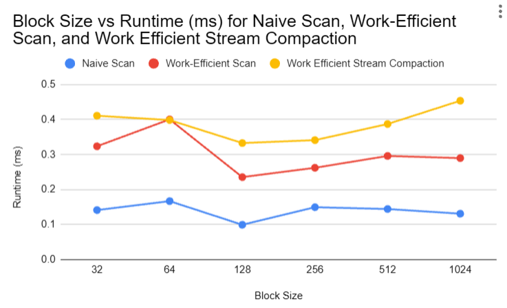
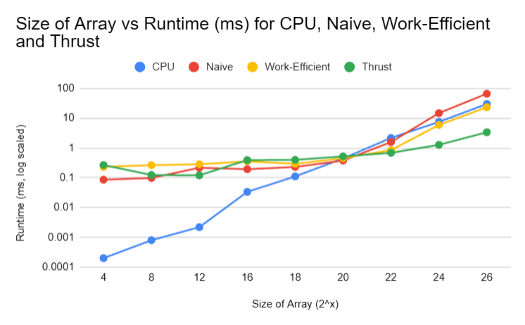
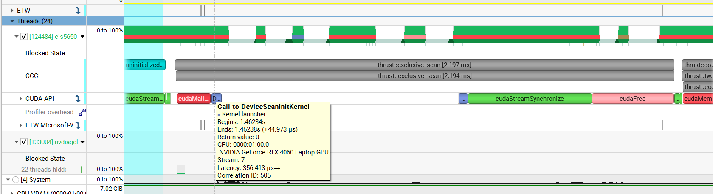
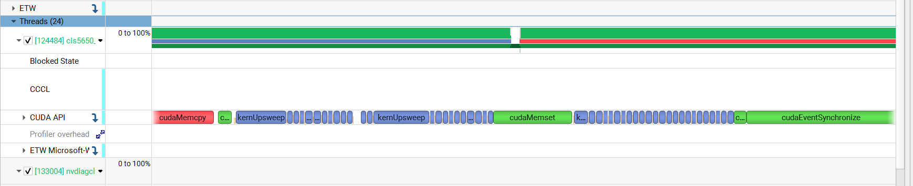
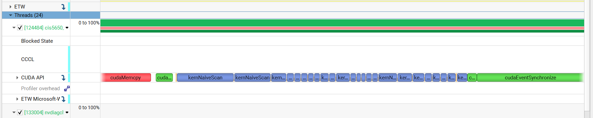

CUDA Stream Compaction
======================

**University of Pennsylvania, CIS 565: GPU Programming and Architecture, Project 2**

* Alice Liu
  * [LinkedIn](https://www.linkedin.com/in/aliceliuu/), [personal website](https://aliceliu.xyz/)
* Tested on: Windows 11, AMD Ryzen 5 7640HS @ 4.30GHz 16GB, RTX 4060 Laptop GPU 8GB (Personal Laptop)

## Overview

In this project, I implemented multiple iterations of prefix sums scan and stream compaction on the CPU and GPU. The stream compaction implementation removes 0s from an array of integers. 

I also optimized the efficient GPU scan to launch only the required number of blocks at each level. This involved making the number of blocks launched at each loop dynamic, and changing indices to match.

The project includes the following features:
* CPU Scan and Stream Compaction
* Naive GPU Scan
* Work-Efficient GPU Scan and Stream Compaction (Optimized)
* Thrust Scan

## Performance Analysis

### Block Size

<p align="center">
  <br>
</p>

While a block size of 128 yielded the lowest runtime in milliseconds, the overall performance difference across block sizes was quite small. I tested on arrays of size 2<sup>8</sup> (256).

### Implementation Comparison on Array Size

<p align="center">
  <br>
</p>

From the data, we can see that for arrays of size less than 2<sup>20</sup>, the CPU implementation consistently performed better than all the other implementations, likely because the overhead cost of the GPU implementations were greater than the parallelization gains. For the smaller array sizes, the CPU implementation was followed overall by Naive, Thrust, then Work-Efficient. 

The Thrust implementation performed the best as the array size grew larger, followed by Work-Efficient, CPU, then Naive. The Thrust implementation was likely able to perform this well due to the fact that it looks like it is launching significantly less kernels compared to my GPU implementations (see below). This likely reduces a lot of the overhead. 

<p align="center">
  <br>
  Thrust Implementation Nsight Systems Timeline
</p>

<p align="center">
  <br>
  Work-Efficient GPU Implementation Nsight Systems Timeline
</p>

<p align="center">
  <br>
  Naive GPU Implementation Nsight Systems Timeline
</p>


The performance bottlenecks were different for each implementation. For the CPU implementation, it was limited by the lack of parallelization, especially when the array size grew, as the algorithm was simply O(n) loop. For the Naive GPU implementation, it was the number of computations and memory bandwith. The algorithm performs O(nlogn) additions and requires a global memory read/write for each. For the Work-Efficient GPU implementation, it was the kernel launching overhead. While it reduces the math to O(n), it requires launching 2 * log2(n) kernels. 

### Test Program Output (128 block size, 2<sup>8</sup> array size)
```
****************
** SCAN TESTS **
****************
    [  11   1   8  46  22  40  45  40  47  17   5  20  40 ...  38   0 ]
==== cpu scan, power-of-two ====
   elapsed time: 0.0006ms    (std::chrono Measured)
    [   0  11  12  20  66  88 128 173 213 260 277 282 302 ... 6226 6264 ]
==== cpu scan, non-power-of-two ====
   elapsed time: 0.0003ms    (std::chrono Measured)
    [   0  11  12  20  66  88 128 173 213 260 277 282 302 ... 6144 6189 ]
    passed
==== naive scan, power-of-two ====
   elapsed time: 0.099424ms    (CUDA Measured)
    passed
==== naive scan, non-power-of-two ====
   elapsed time: 0.093184ms    (CUDA Measured)
    passed
==== work-efficient scan, power-of-two ====
   elapsed time: 0.23552ms    (CUDA Measured)
    passed
==== work-efficient scan, non-power-of-two ====
   elapsed time: 0.124928ms    (CUDA Measured)
    passed
==== thrust scan, power-of-two ====
   elapsed time: 0.074752ms    (CUDA Measured)
    passed
==== thrust scan, non-power-of-two ====
   elapsed time: 0.0408ms    (CUDA Measured)
    passed

*****************************
** STREAM COMPACTION TESTS **
*****************************
    [   3   1   0   0   0   0   1   0   3   3   3   2   2 ...   0   0 ]
==== cpu compact without scan, power-of-two ====
   elapsed time: 0.0006ms    (std::chrono Measured)
    [   3   1   1   3   3   3   2   2   3   2   3   2   3 ...   3   1 ]
    passed
==== cpu compact without scan, non-power-of-two ====
   elapsed time: 0.0006ms    (std::chrono Measured)
    [   3   1   1   3   3   3   2   2   3   2   3   2   3 ...   3   1 ]
    passed
==== cpu compact with scan ====
   elapsed time: 0.0028ms    (std::chrono Measured)
    [   3   1   1   3   3   3   2   2   3   2   3   2   3 ...   3   1 ]
    passed
==== work-efficient compact, power-of-two ====
   elapsed time: 0.3328ms    (CUDA Measured)
    passed
==== work-efficient compact, non-power-of-two ====
   elapsed time: 0.136192ms    (CUDA Measured)
    passed
Press any key to continue . . .
```